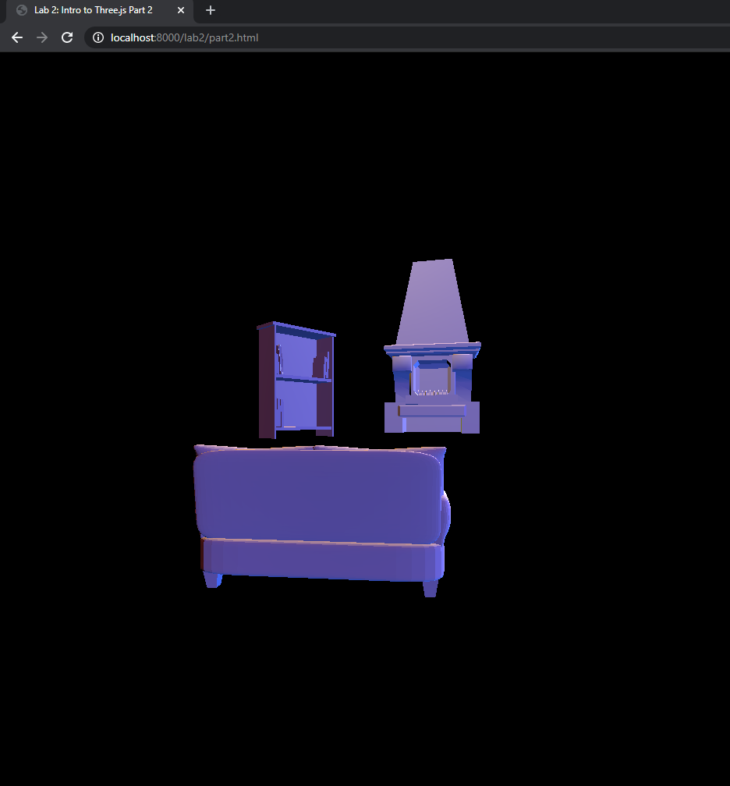
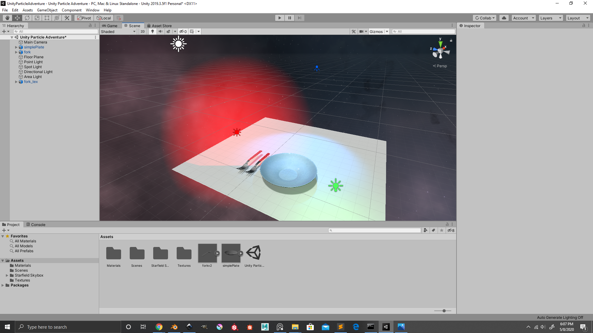
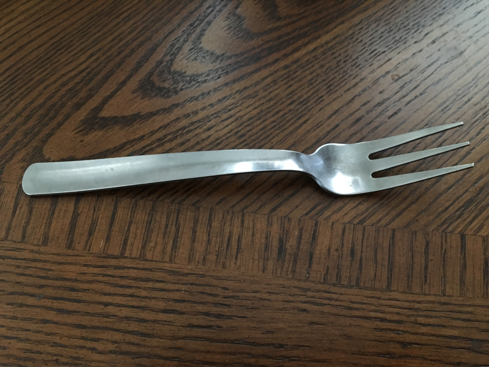
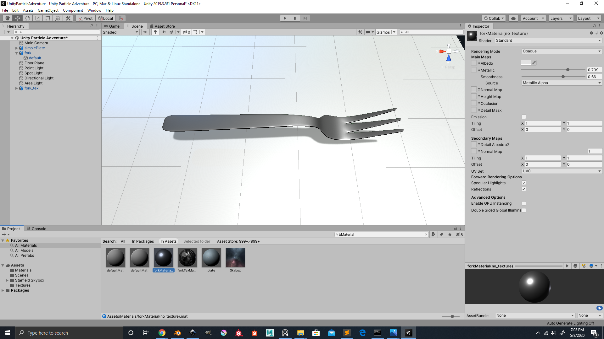
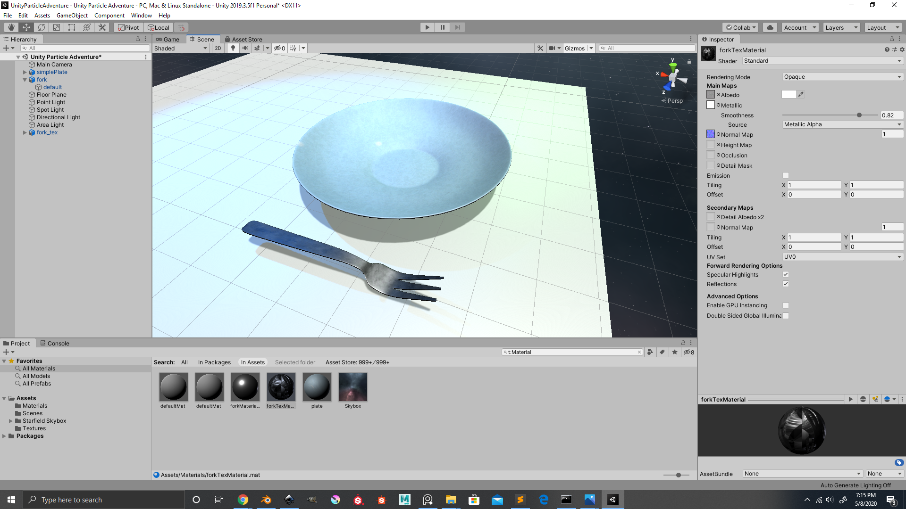

# CMPM163Labs #
## lab 2 ##
video: https://drive.google.com/file/d/1S7eR3p3pjnNppW0noad0Q4kCPNUwy5WR/view?usp=sharing

## lab 3 ##
video: https://drive.google.com/file/d/1ek85-auk9Tzf8-pSZu05CoLLIh-uClGt/view?usp=sharing

cube on upper left: the green specular highlight is made with three.js phong material\
cube on upper right: the visible points are made with three.js points material\
cube on lower left: the two color interpolation is made with a custom shader\
cube on lower right: the four color interpolation is made with a custom shader

## lab 4 ##
Lab Questions:\
(images given in lab 4 description)\
a. What is the formula given a u value of the uv coordinate (a value between 0 and 1), I get the x value of the pixel to sample from in this 8x8 texture?\
x = 8u //scale u value 8 times to fit texture \
b. What is the formula given a v value of the uv coordinate (a value between 0 and 1), I get the y value of the pixel to sample from in this 8x8 texture?\
y = -8v+8 //scale v value 8 times and flip over vertical axis to fit texture and re-position \
c. What color is sampled from the texture at the uv coordinate (0.375, 0.25)? (sample from the image based on the number your formula gives you i.e. (1, 0) is blue)\
x = 8*(0.375) = 3 \
y = -8*(0.25)+8 = 6 \
(3, 6) is white\
\
video: https://drive.google.com/file/d/1C11fxgNjLWbyBKmCvnmMwK7u9JWb9V0j/view?usp=sharing

cube first to the left: steel floor texture loaded with three.js built in texture functionality\
cube second to the left: steel floor texture with normals loaded with three.js built in texture functionality\
cube third to the left: engraved wood texture with normals loaded with three.js built in texture functionality\
cube fourth to the left: pebble texture loaded with shaders\
cube fifth to the left: brick texture tiled 2x2 loaded with shaders. To make this, I started with scaling the tile down by multipling the vUv by 2. This gave me the bottom left tile. I then went ahead and experimented with different values to get the tile appearing on the other three positions on the cube by adding and substracting vUv with floating point values. Substracting vUv by 0.5 gave me the upper right tile. In order to get the top left and bottom right tiles, I used vec2 to test substracting values on vUv.x and vUv.y individually until I got the tiles on their correct positions. I then went ahead to get them to load individually only on their repective positions without overlapping other tiles by setting boundaries with if statements.

## lab 5 ##
video: https://drive.google.com/file/d/1FoyttxGvU9pLTkDrtjvfEP6mMAuUZ_Gm/view?usp=sharing

I choose to do part 1 for lab 5. In this lab, I created a back tire spark and glow effect from following the recommended tutorial. I added a starfield skybox (credit: PULSAR BYTES) and created a fire particle effect. The fire particle effect is created from a game object particle system and modifying its color, start speed, size, emission, shape, etc.. until it looked like a slow glowing orange blob rising from the bottom. I then duplicated it and changed the duplicate color to white and scaled it down into the flame's center. I also added in assets from the mod folder and edited the materials from the original assets into the scene to create a sci fi, time paradox theme for this game. 

## lab 6 ##
Part I option: \
i. 
	1. Point light: green light furthest to the right\
	2. Spot light: blue light second to the right\
	3. Directional light: white light furthest to the left\
	4. Area light: red light second to the left\
	5. Real life object with material: fork on the left\
	6. Two textured objects: fork on the right and plate\
	7. Skybox: starfield skybox by PULSAR BYTES\
ii. \
iii. Found object image: \
Recreation of material and model in unity. The model is made by me in blender 3D (I didn't realized until after texturing that the back tip of the fork is supposed to be round and not completely flat) and the material is created in unity:
lab6_part_iii_recreation\
iv. I made the material of the fork look like the object by changing the material's albedo color to light gray and then increasing the metallic and smoothness values until it looked like metal.\
v. The two textured objects are another fork and a plate. Both are textured by me in substance painter and I exported their albedo, metallic, and normal maps to make their textured material in unity. I choose to reuse the fork model just to show the difference textures can add to the look of a material.
\
vi. The skybox used in this scene is a starfield skybox created by PULSAR BYTES.